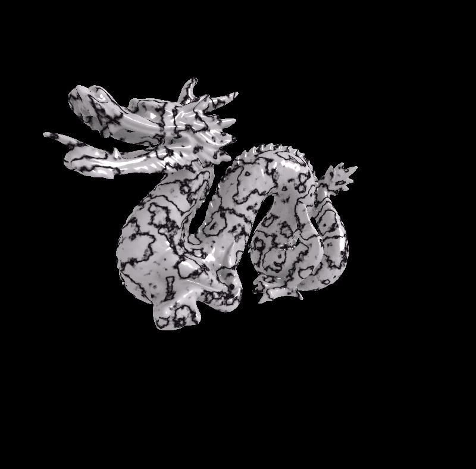

<h1>JORL - Jeremy's Original Graphics Library</h1>

This library is split between the Core and Extensions. 

<h2>Core library</h2>

The Core library contains definitions of the base classes for the Shader, GLGeometry, Object, Material, TextureManager and Camera classes, most of which are not functional as is. In addition, it includes implementations of Texture, Framebuffer, and Drawable classes.

<h2>Extensions library</h2>

The Extensions library contains multiple implementations of many of the base classes, and is a collection of useful functions, classes and shaders for various projects.

<h2>VR</h2>

VR contains some useful functionality for incorporating the JORL library with a VR application. Currently only supports openvr. 

<h2>Examples</h2>

The examples project contains several sample application that demonstrate how to use the JORL library.

